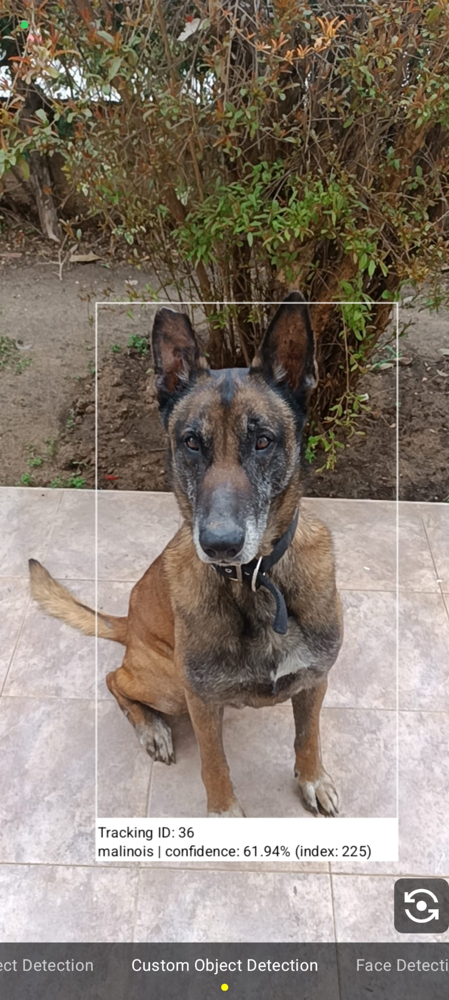

#  Playground Detection App 
An Android app built with MVVM architecture, utilizing **CameraX** and **Google ML Kit** for real-time image analysis.

The app features multiple detectors: a custom object detector using an **EfficientNet** custom model, a general object detector using a pre-built MLKit model and a face detector.
**It displays a live camera feed with overlay effects showing detection details** (e.g., bounding boxes and probability of smiling for face detection).

The app is **modularized**, allowing the CameraX module to be imported into other existing apps.
It leverages **Hilt** for dependency injection, **Jetpack Compose** for UI, **Kotlin** as the programming language, and **Google Accompanist** for runtime permissions support.

## 🚀 Features

- **Live Camera Feed**: Real-time preview powered by CameraX framework.
- **Multiple Image Detectors**:
    - **Custom Object Detector**: Uses a custom EfficientNet model.
    - **General Object Detector**: Uses ML Kit's pre-built model.
    - **Face Detector**: Detects faces with facial landmarks and expressions (e.g., smile detection).
- **Dynamic Detector Selection**: Users can switch between detectors.
- **Overlay Effects for Detection Results**: Draw bounding boxes and detection details (e.g., confidence scores) on the live feed.
- **Camera Lens Switching**: Toggle between front and back cameras.
- **Generic Programming**: New ML Kit detectors (e.g., Barcode, Pose Detector) can be easily integrated.
- **Modular Design**: CameraX module can be easily imported into other apps for camera-based image analysis.

## 📸 Screenshots

  

## 📦 Tech Stack

- **Architecture**: MVVM
- **Language**: Kotlin
- **UI**: Jetpack Compose
- **Dependency Injection**: [Hilt](https://developer.android.com/training/dependency-injection/hilt-jetpack)
- **Camera Framework**: [CameraX](https://developer.android.com/media/camera/camerax)
- **Machine Learning**: [Google ML Kit](https://developers.google.com/ml-kit/guides)
- **Permissions Handling**: [Google Accompanist](https://github.com/google/accompanist) 

## 🔧 Custom Models
The custom object detector uses an **EfficientNet** model stored at:  
`feature/camerax/assets/custom_models/`

Additional models can be downloaded from **TensorFlow Hub**:  
[Image Classification Collection](https://tfhub.dev/ml-kit/collections/image-classification/1)

## Project Structure
    app/
    └── feature/
         ├── camerax/                  # CameraX module implementation
         │   └── assets/
         │       └── custom_models/    # Location of the **EfficientNet** custom model
         │
         └── home/                     # Home module - contains runtime permissions handling
